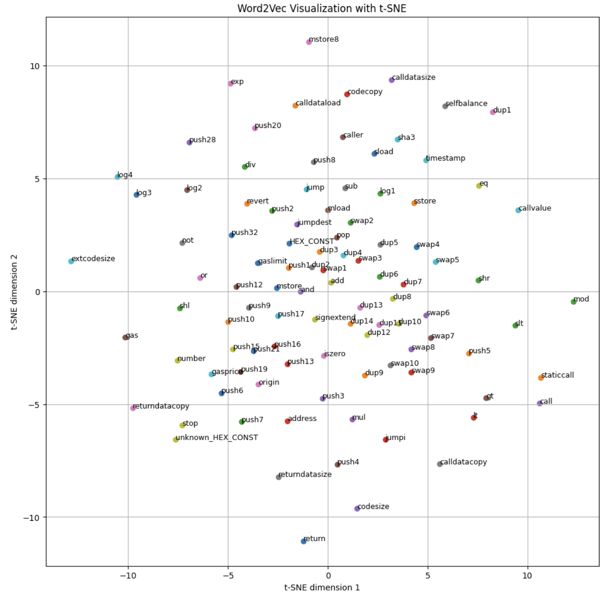

# Machine Learning-Based Detection of Malicious Smart Contracts

**Albert Baichorov, Semen Semenov, Jason Banks**  
Mohamed Bin Zayed University of Artificial Intelligence, Abu Dhabi, UAE  
*{Albert.Baichorov, Semen.Semenov, Jason.Banks}@mbzuai.ac.ae*  
**Group ID = G-40**

## Abstract

Malicious smart contracts on blockchain platforms pose significant security risks, necessitating robust detection mechanisms. This project focuses on detecting malicious Ethereum smart contracts using machine learning techniques. We leveraged Forta's Malicious Smart Contract Dataset and developed a pipeline that preprocesses opcode sequences and applies feature extraction techniques such as Word2Vec embeddings and TF-IDF representations. Multiple models, including Logistic Regression, Support Vector Machines (SVM), and LightGBM, were evaluated. This work contributes to the field of blockchain security by offering an interpretable and efficient framework for identifying malicious smart contracts.

## Datasets

In this work, we used Forta's Malicious Smart Contract Dataset, which provides a comprehensive collection of Ethereum smart contracts labeled as either malicious or benign. Each contract entry includes detailed information such as the contract address, name, Etherscan labels, tags, creator's address, bytecode, opcodes, a malicious indicator, creator tags, source, notes, and creator's Etherscan labels. This dataset serves as a valuable resource for analyzing the characteristics and behaviors of smart contracts, facilitating research and development in blockchain security and malicious contract detection.

The dataset includes the following fields:

- **contract_address**: Unique identifier of the smart contract
- **contract_name**: Name assigned to the contract
- **contract_etherscan_label**: Tags from Etherscan indicating contract characteristics
- **contract_tag**: Additional tags associated with the contract
- **contract_creator**: Address of the entity that deployed the contract
- **contract_creation_tx**: Transaction hash of the contract's creation
- **creation_bytecode**: Bytecode used during contract deployment
- **decompiled_opcodes**: Sequence of operation codes representing the contract's functionality
- **malicious**: Boolean flag indicating if the contract is malicious
- **contract_creator_tag**: Tags associated with the contract creator
- **source**: Source from which the data was obtained
- **notes**: Additional notes regarding the contract
- **contract_creator_etherscan_label**: Etherscan labels for the contract creator's address

For our analysis, we focused on the `decompiled_opcodes` and `malicious` fields. The opcodes provide a low-level representation of the contract's operations, which are crucial for detecting malicious behavior.

## Features

To transform the opcode sequences into numerical features suitable for machine learning models, we employed two techniques:

- **Word2Vec Embeddings**: We treated each opcode as a "word" and each contract's sequence of opcodes as a "sentence." Using the Word2Vec model, we generated continuous vector representations for each opcode, capturing semantic similarities between different operations. This approach is inspired by natural language processing techniques, where Word2Vec is used to capture semantic relationships between words.

- **TF-IDF Representation**: Term Frequency-Inverse Document Frequency (TF-IDF) was applied to the opcode sequences. This method assigns weights to opcodes based on their frequency within a contract and their rarity across all contracts, highlighting opcodes that are particularly indicative of malicious behavior.

## Architectures

We evaluated the following machine learning models:

- **Logistic Regression**: A linear classifier suitable for binary classification tasks
- **Support Vector Machines (SVM)**: Effective in high-dimensional spaces, SVMs are robust against overfitting, especially in cases where the number of dimensions exceeds the number of samples
- **LightGBM (LGBM)**: A gradient-boosting framework that is efficient and scalable, particularly with large datasets

## Results

The performance of different models and feature extraction techniques for classifying smart contracts as malicious or benign is summarized in the following table:

| Model | F1 Score | Precision | Recall |
|-------|-----------|-----------|---------|
| Logistic Regression + TF-IDF (**baseline**) | 0.02 | 0.01 | 0.69 |
| Logistic Regression + Word2Vec100 | 0.61 | 0.58 | 0.64 |
| Logistic Regression + Word2Vec256 | 0.59 | 0.58 | 0.61 |
| Logistic Regression + Word2Vec512 | 0.62 | 0.63 | 0.61 |
| LGBM + Word2Vec100 | 0.39 | 0.90 | 0.25 |
| LGBM + Word2Vec256 | 0.35 | 0.90 | 0.22 |
| LGBM + Word2Vec512 | 0.41 | 0.77 | 0.28 |
| SVM + Word2Vec100 | 0.60 | 0.62 | 0.58 |
| SVM + Word2Vec256 | 0.63 | 0.71 | 0.56 |
| SVM + Word2Vec512 | 0.63 | 0.68 | 0.59 |
| **SVM + TF-IDF** | **0.77** | **0.79** | **0.75** |

## Conclusion

This project proposed a machine learning-based framework for detecting malicious smart contracts by analyzing their assembly-level opcode sequences. Leveraging feature extraction techniques such as TF-IDF and Word2Vec, combined with machine learning models like SVM and LightGBM, we demonstrated that SVM with TF-IDF achieved the best performance with an F1 score of 0.77. The findings highlight the importance of address manipulation and opcode patterns in identifying malicious behaviors. While the approach shows promise in improving the security of decentralized finance systems, challenges such as generalizability, real-time applicability, and scalability remain. Future work can explore advanced deep learning models, dataset diversification, and integration into blockchain platforms to further enhance detection capabilities and strengthen trust in blockchain ecosystems.

## References

[1] Forta. How forta’s predictive ml models detect attacks before exploitation. *Forta Blog*, 2023. Accessed: 2024-11-23.

[2] Forta. Malicious smart contract dataset. [https://huggingface.co/datasets/forta/malicious-smart-contract-dataset](https://huggingface.co/datasets/forta/malicious-smart-contract-dataset), 2023. Accessed: 2024-11-23.
